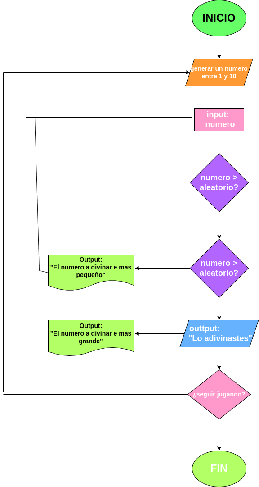

# ADIVINAR UN NUMERO DEL 1 AL 10

# Analisis

la maquina te pedira que dijites un numero entre 1 y 10. Esta dependiendo de su resultado random te dira si es correcto o incorrecto

## Input

### Variables de entrada

maq:te pedira dijitar un numero del 1 al 100

### Proccesing

usu:(pone el numero el numero respectivo que le dice a ala maq)

maq: (dependiendo de su sistema random. maq te dira si esta bonito o esta culero)

### Output

# Diseño/Diagrama

# Construccion